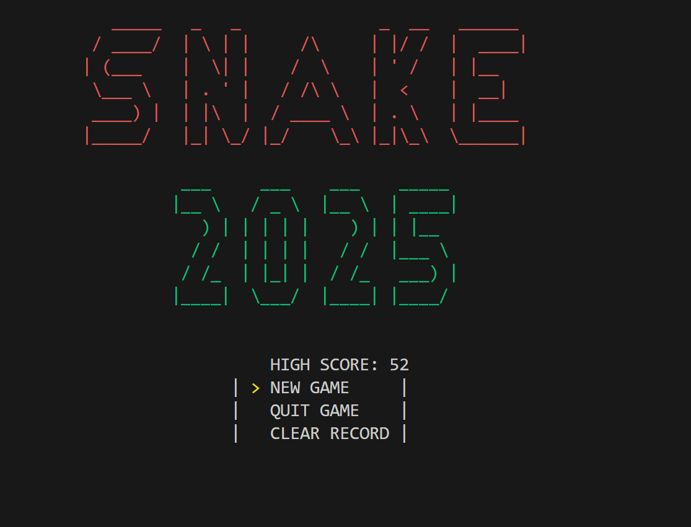

# Snake Game in Assembly

I have made a Snake game in assembly language as part of my learning journey to learn assembly. The code is probably really bad as this was me learning assembly.

## Files

- `main.asm`: The main entry point of the game.
- `menu.asm`: Handles the game menu logic.
- `game.asm`: Contains the game loop and logic for the Snake game.
- `printGame.asm`: Responsible for rendering the game state.
- `printMenu.asm`: Responsible for rendering the menu.
- `spawnFruits.asm`: Logic for spawning fruits in the game.
- `highscore.asm`: Handles loading and saving the high score.
- `myLib/`: Contains various utility functions and macros used in the game.

## Utility Files

- `myLib/save_termois.asm`: Saves the terminal state.
- `myLib/rand_int.asm`: Generates a random integer within a specified range.
- `myLib/print_flush.asm`: Flushes the print buffer to the terminal.
- `myLib/get_time.asm`: Retrieves the current time.
- `myLib/get_input.asm`: Handles user input.
- `myLib/print_decimal.asm`: Prints decimal numbers.
- `myLib/print_ascii_value.asm`: Prints ASCII values.
- `myLib/print.asm`: General print functions.
- `myLib/file_open.asm`: Opens a file.
- `myLib/file_read.asm`: Reads from a file.
- `myLib/file_close.asm`: Closes a file.
- `myLib/raw_mode.asm`: Enables raw mode for the terminal.
- `myLib/reset_termois.asm`: Resets the terminal state.
- `myLib/sleep.asm`: Pauses execution for a specified time.
- `myLib/move_ascii_cursor.asm`: Moves the ASCII cursor.
- `myLib/exit.asm`: Exits the program.

## High Score

The high score is stored in the `highScore.txt` file.

## How to Run

1. Assemble the code using an assembler like `nasm`.
2. Link the object files.
3. Run the executable.

## Restoring Terminal State

In case the game crashes and does not restore the terminal to its default state, you can use the `./back` executable. This file is designed to reset the terminal settings, ensuring that your terminal returns to its normal state. 
**Note:** The `./back` executable uses the `Termois.txt` file. It will not work without it.

## Disclaimer

This project was created for educational purposes and may contain inefficient or incorrect code as it was part of my learning process.
